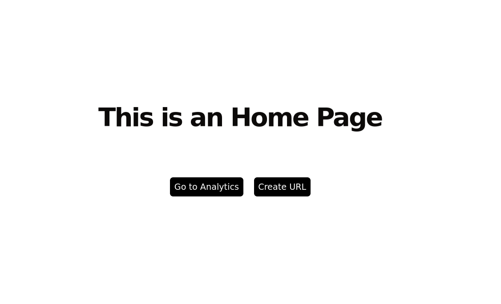
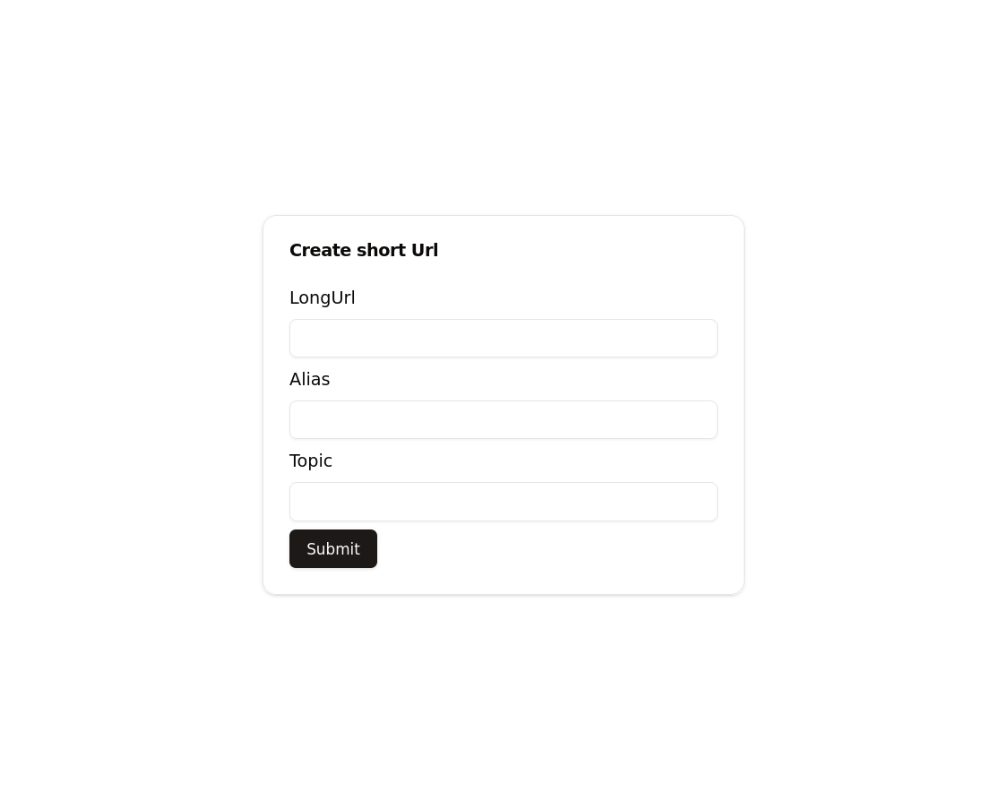
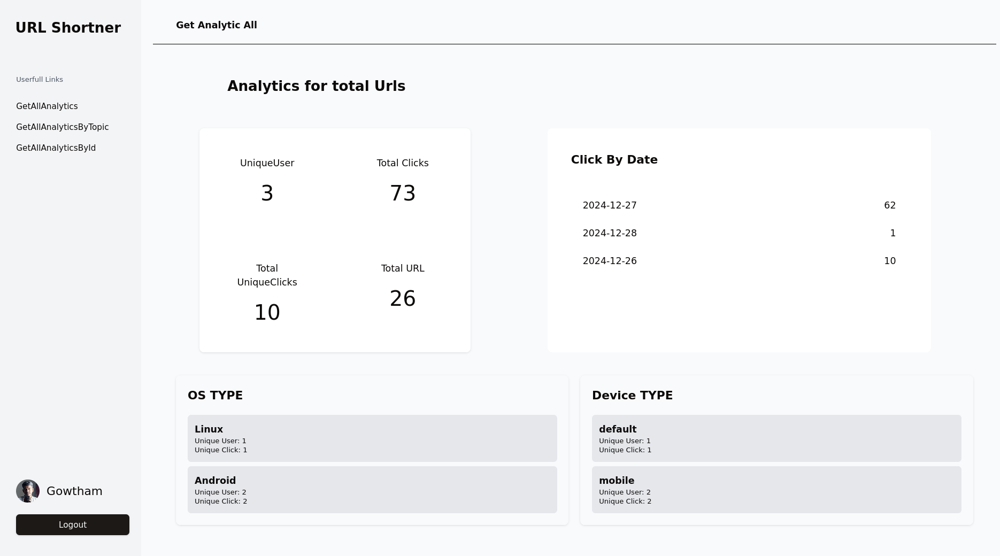
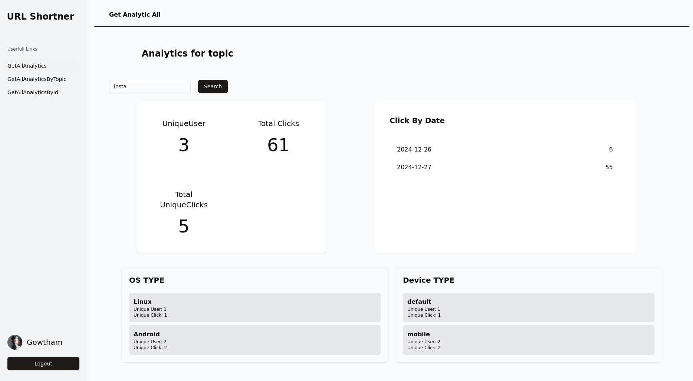
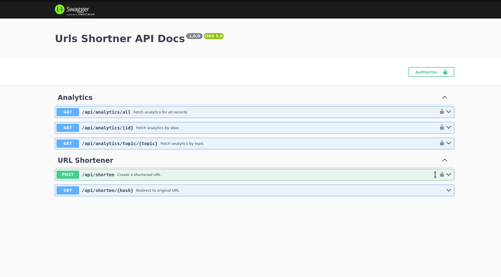
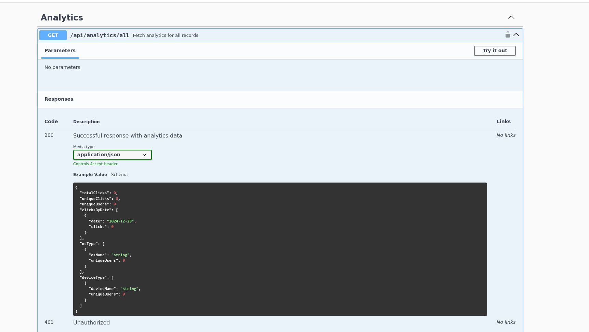
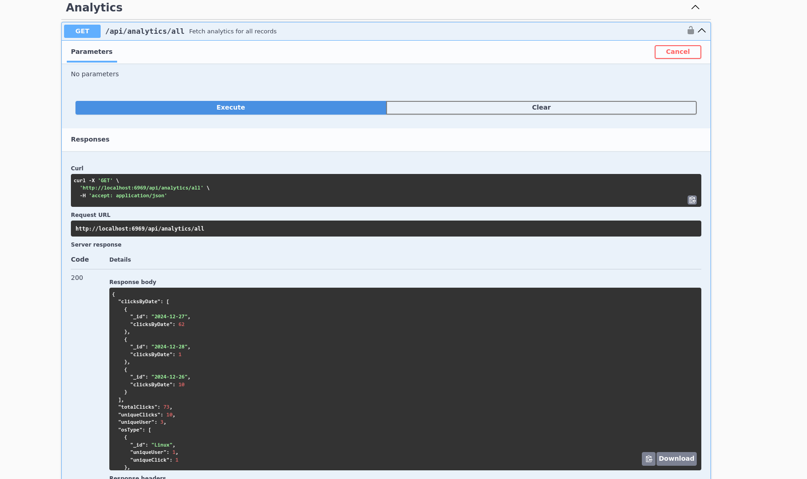

# Scalabel url shortener

This is hosted in AWS

Frontend end [http://url.gowtz.tech](http://url.gowtz.tech)

Backend end [http://url.gowtz.tech:6969](http://url.gowtz.tech:6969)

> Note please change frontend url from `https` to `http` in the browser

A robust url shortener built with typescript, offering seamless url shortening and redirection. it leverages redis for high-speed caching and persistence, and includes a rate limiter for controlled api usage. the backend is well-documented with swagger for easy api exploration and testing. the application is fully containerized using docker, ensuring streamlined deployment and scalability. the frontend, developed with react, delivers a user-friendly interface for managing and accessing shortened urls. docker compose is configured for effortless multi-container orchestration. the architecture is optimized for performance, reliability, and ease of use. perfect for developers and end-users looking for a modern and efficient url management solution.a robust url shortener built with typescript, offering seamless url shortening and redirection. it leverages redis for high-speed caching and persistence, and includes a rate limiter for controlled api usage. the backend is well-documented with swagger for easy api exploration and testing. the application is fully containerized using docker, ensuring streamlined deployment and scalability. the frontend, developed with react, delivers a user-friendly interface for managing and accessing shortened urls. docker compose is configured for effortless multi-container orchestration. the architecture is optimized for performance, reliability, and ease of use. perfect for developers and end-users looking for a modern and efficient url management solution.

## Features

The entire project is built using TypeScript, ensuring strong typing, reduced runtime errors, and better code maintainability. This enables a robust developer experience and easier debugging.

### Rate Limiting

Integrated rate limiter to control the frequency of API requests, protecting the application from abuse and ensuring fair usage for all users.

### Redis Caching

Uses Redis for efficient caching and data persistence, ensuring faster URL lookups and high performance under heavy loads.

### OAuth with Google

Provides secure and seamless user authentication through Google OAuth, simplifying access control and personalization for users.

### Documented with Swagger

Comprehensive API documentation with Swagger makes it easy for developers to explore and integrate the service. Interactive documentation helps test endpoints directly.

### Dockerized

The backend and frontend are containerized using Docker, ensuring consistent environments across development, testing, and production.

### Frontend with React

A sleek and intuitive React-based frontend allows users to shorten, manage, and access URLs effortlessly, enhancing the overall user experience.

### Docker Compose Integration

Simplified multi-container orchestration with Docker Compose enables quick setup and management of both backend and frontend services.n with Docker Compose enables quick setup and management of both backend and frontend services.

### MongoDB Aggregation for Optimized Database Calls

To optimize frequent database calls, MongoDB's aggregation framework is used to efficiently process and aggregate data within the database itself. By utilizing aggregation pipelines, operations like filtering, sorting, and grouping are handled directly by MongoDB, reducing the need for multiple queries and improving performance. This optimization helps minimize the load on the server and accelerates data retrieval times.

# Run the Application

1. Download the Github Repo `git clone https://github.com/gowtz/url.git`.
2. Now move to url folder and open docker-compose.yml file and fill the env variables of `GOOGLE CLIENT_ID` and `GOOGLE_SCRETE`
3. Then run `docker compose up -d`

### Pictures

  

  

  

  

  

  

  

